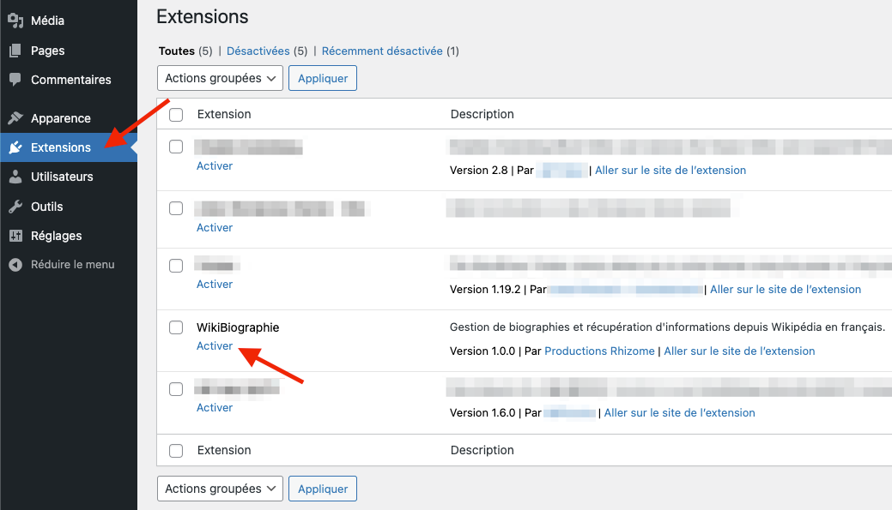
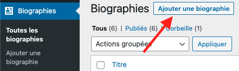
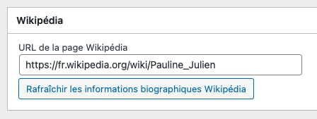
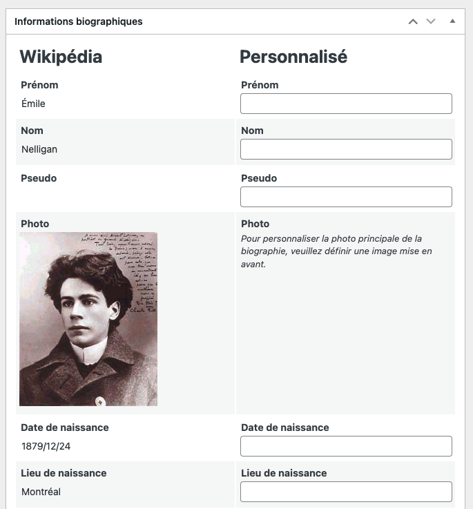
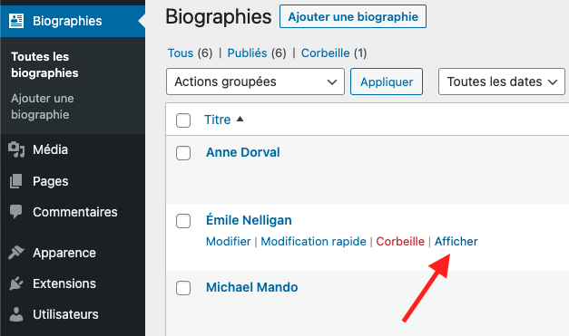
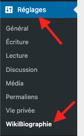
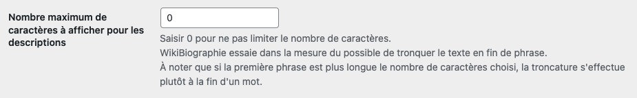
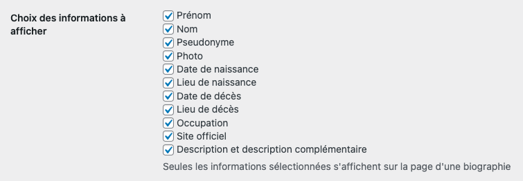

# WikiBiographie

# Introduction

WikiBiographie est une extension pour WordPress qui offre la possibilité de gérer une collection de biographies de personnalités. Sa force réside dans le fait qu'il est possible de récupérer les informations directement de Wikipédia en français, facilitant ainsi le travail de rédaction.

# Installation

L'extension peut être installée en copiant son dossier décompressé `wikibiographie` dans le dossier `wp-content/plugins` du site WordPress.

Une fois installée, il convient d'activer l'extension. Pour cela, se rendre dans le panneau d'administration du site WordPress, et cliquer sur le lien "Activer" en dessous du nom de l'extension "WikiBiographie".

  

Voilà ! L'extension est désormais activée. Un nouveau type d'article devient accessible depuis le menu latéral : "Biographies".

# Utilisation

  

Les articles de type "Biographie" sont accessibles via le menu latéral du panneau d'administration. La page des biographies permet de consulter et de modifier les biographies existantes, ainsi que de créer de nouvelles biographies.

## Ajouter une biographie

  

En cliquant sur le bouton "Ajouter une biographie" depuis la liste des biographies, le formulaire de création de biographie s'ouvre. Ce formulaire se divise en deux panneaux distincts : "Wikipédia" et "Informations biographiques".

### Panneau Wikipédia

  

Ce panneau permet de spécifier l'URL de la page Wikipédia à partir de laquelle récupérer les informations biographiques. Lorsque ce champ est renseigné, Wikipédia devient la source principale du contenu de la biographie.

Le bouton "Rafraîchir les informations biographiques Wikipédia" récupére les informations à la volée pour les afficher directement dans la partie "Wikipédia" du panneau "Informations biographiques". Il est là pour faciliter la suite de la rédaction de la biographie.

### Panneau Informations biographiques

  

Ce panneau offre les divers champs disponibles d'une biographie. Il est divisé en deux volets, "Wikipédia" et "Personnalisé".

Le volet "Wikipédia" affiche les informations provenant de Wikipédia lorsque c'est applicable, c'est-à-dire lorsqu'une URL de page Wikipédia valide a été renseignée dans le champ du panneau "Wikipédia".

Le volet "Personnalisé" offre des champs éditables par l'édimestre. Lorsqu'une URL Wikipédia est renseignée, ces champs permettent de ne pas tenir compte de ce qui provient de Wikipédia, ou, dans le cas du champ "Description complémentaire", d'ajouter des informations supplémentaires. Dans le cas où aucune URL Wikipédia n'est renseignée, ces champs constituent la seule source de contenu de la biographie. Il devient alors important de les compléter.

Les champs sont détaillés ci-dessous.

| Intitulé du champ | Type d'information tirée de Wikipédia (si applicable) | L'information personnalisée supplante celle de Wikipédia | Notes
| --- | --- | --- | --- |
| Nom et prénom | Titre de la page Wikipédia en français | Oui | - |
| Prénom | Wikidata P735 | Oui | - |
| Nom | Wikidata P734 | Oui | - |
| Pseudonyme | Wikidata P742 | Oui | - |
| Photo | Wikidata P18 | Oui, définir pour cela une "image mise en avant" | - |
| Date de naissance | Wikidata P569 | Oui | - |
| Lieu de naissance | Wikidata P19 | Oui | - |
| Date de décès | Wikidata P570 | Oui | - |
| Lieu de décès | Wikidata P20 | Oui | - |
| Occupation | Description de la page Wikipédia en français | Oui | - |
| Site officiel | Wikidata P856 | Oui | - |
| Description | Texte d'introduction de la page Wikipédia en français | Oui | - |
| Description complémentaire | N/A | Non, ce champ est libre, sans équivalent avec Wikipédia  | Le texte saisi dans ce champ s'ajoute à la suite du champ "Description" |

## Consulter une biographie

  

En survolant une biographie de la liste, il suffit de cliquer sur le lien "Afficher" pour consulter la biographie telle qu'elle est affichée sur le site. À noter que si la biographie n'est pas publiée, le lien devient "Aperçu". La biographie s'affiche en utilisant le gabarit par défaut de l'extension. Il est possible de définir un gabarit personnalisé pour l'affichage d'une biographie (à nommer "single-biographie.php") et pour l'affichage des listes de biographies (à nommer "archive-biographie.php").

## Modifier une biographie

Il suffit de cliquer sur le nom de la biographie à modifier depuis la liste des biographies.

## Personnaliser l'affichage des biographies

Les gabarits (templates) fournis avec l'extension sont une base qu'il est conseillé d'adapter au thème utilisé sur le site WordPress. Pour ce faire, il suffit de créer un dossier nommé `wikibiographie` dans le dossier du thème et d'y ajouter deux fichiers : `single-biographie.php` et `archive-biographie.php` configurés selon les besoins. Se baser sur les fichiers originaux situés dans le dossier `templates` de l'extension WikiBiographie si nécessaire.

## Gérer les paramètres de l'extension

  

Le lien "WikiBiographie" situé dans la partie "Réglages" du menu latéral du panneau d'administration permet d'accéder au panneau de configuration de l'extension.

Les actions possibles et les paramètres configurables sont mentionnés ci-après.

### Vider les biographies Wikipédia en cache

Afin d'éviter de multiplier les appels à Wikipédia à chaque consultation d'une biographie, l'extension WikiBiographie utilise la fonctionnalité de "transient" de WordPress. Cela signifie que les informations biographiques provenant de Wikipédia sont stockées pour une certaine durée, on dit qu'elles sont mises en cache. Les informations sont de nouveau récupérées de Wikipédia lorsqu'une biographie est consultée sur le site et que les données mises en cache sont expirées.

S'il est nécessaire de supprimer toutes les informations mises en cache, il suffit de cliquer sur le bouton "Vider les données mises en cache".

  

### Gérer la durée de mise en cache des biographies provenant de Wikipédia

Les informations mises en cache ne le sont que pour une durée limitée. Cette durée est configurable selon des valeurs prédéfinies dans la liste déroulante. Il est à noter que la nouvelle durée choisie n'affectera pas les informations déjà mises en cache aussi longtemps que celles-ci demeureront valides.

  

Il est simple d'invalider les informations mises en cache, il suffit de les vider (voir "Vider les biographies Wikipédia en cache").

### Limiter le nombre maximum de caractères à afficher pour les descriptions

Ce paramètre permet de limiter le nombre caractères affichés de l'information "Description" sur la page d'une biographie (ne concerne pas "Description complémentaire" qui est un champ libre). Mettre la valeur "0" (zéro) pour ne pas limiter le nombre de caractères affichés.

  

WikiBiographie essaie avant tout de tronquer le texte à la fin d'une phrase, dans la limite du nombre maximum choisi. Si cela n'est pas possible, la troncature s'effectue plutôt en fin de mot.

### Choisir les informations à afficher

Il est possible de ne pas afficher certaines informations biographiques simplement en les décochant.

  